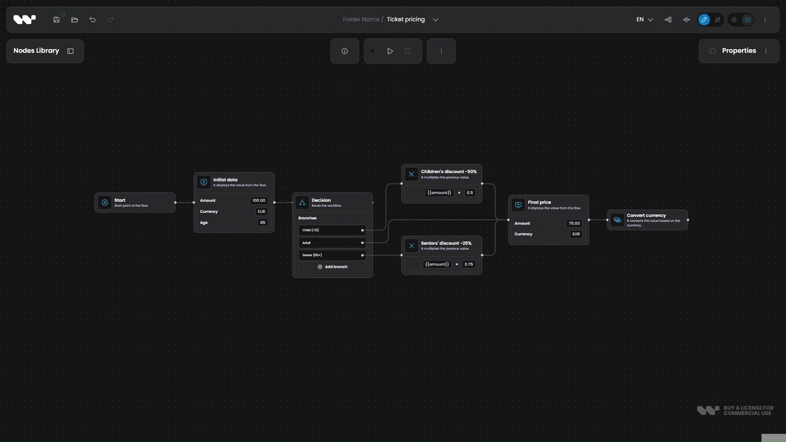

<div align="center">

<a href="https://www.workflowbuilder.io/"></a>

[Live Demo](https://app.workflowbuilder.io/) &nbsp;|&nbsp; [Documentation](https://www.workflowbuilder.io/docs/overview/) &nbsp;|&nbsp; [Website](https://www.workflowbuilder.io/)

*Workflow Builder*
**Apache 2.0 React SDK for embedding visual workflow editors.**

Drag-and-drop workflow builder UI with a reference back-end and an execution engine swappable by design, proven with Temporal. Back-end agnostic. Built on React Flow and Temporal. Reference stack for AI workflows and automations in digital products. 

---

[](https://github.com/synergycodes/workflowbuilder/actions/workflows/build.yml)
[](./LICENSE)
[](https://discord.com/invite/FDMjRuarFb)



[Try it live ->](https://app.workflowbuilder.io/)

Used in production by teams including [Vercom](https://www.workflowbuilder.io/case-study/vercom), [Athena Intelligence](https://www.workflowbuilder.io/case-study/athena-intelligence), [Plura AI](https://www.workflowbuilder.io/case-study/plura-ai), and others.

</div>

> 🎉 **Workflow Builder 2.0 is here.**
>
> A best-in-class SDK for embedding workflow editors, now paired with a dedicated reference backend and a fully modular plugin surface. Building products on top of a workflow editor has never been easier.
>
> Starting with 2.0, this repository is the home of Workflow Builder. Previously we worked in a private monorepo and only partially mirrored changes here. From now on, every commit lands here directly.
>
> See the [CHANGELOG](./CHANGELOG.md) for everything that's changed since the last release.

## Get started

Three onboarding paths. Pick one based on what you want to evaluate.

| Goal                                                   | Path                                                          | Setup time | Docker |
| ------------------------------------------------------ | ------------------------------------------------------------- | ---------- | ------ |
| See the editor running in your browser                 | [A. Try the demo](#path-a-try-the-demo)                       | ~2 min     | no     |
| Run the full reference stack (editor + execution + AI) | [B. Run the full stack demo](#path-b-run-the-full-stack-demo) | ~10 min    | yes    |
| Use the SDK inside your own React app                  | [C. Embed the SDK](#path-c-embed-the-sdk)                     | see docs   | no     |

Want to skip the clone entirely? [Try the live demo](https://app.workflowbuilder.io) first.

### Requirements

- Node `22.12.0` and pnpm `10.9.0`. Both pinned in `package.json`. Use `nvm`, `fnm`, or `corepack` to match.
- Docker Desktop. Only required for Path B.

Works the same on macOS, Linux, and Windows. No platform-specific steps.

### Preflight check

Run this once after cloning. It verifies Node, pnpm, Docker, port availability, and required `.env` files.

```bash
pnpm install
pnpm preflight
```

Expected output:

```
Workflow Builder preflight

✅ node                        22.12.0
✅ pnpm                        10.9.0
✅ docker                      running
✅ port_3001                   free (backend)
✅ port_4200                   free (demo)
✅ port_4201                   free (ai-studio)
✅ port_5432                   free (postgres)
✅ port_5433                   free (temporal-db)
✅ port_7233                   free (temporal)
✅ port_8233                   free (temporal-ui)
⚠️  apps/backend/.env           missing — copy from apps/backend/.env.example
⚠️  apps/execution-worker/.env  missing — copy from apps/execution-worker/.env.example

Ready to go. Pick a path in README.md "Get started".
```

The two `.env` warnings are expected on a fresh clone. They are only required for Path B and get created by `pnpm setup:env` in step 1 of that path. After that they switch to `✅ present`.

Fix any red (`❌`) items before continuing. The script also has a `--json` mode for tooling: `pnpm preflight --json`.

### Path A. Try the demo

UI only. No backend, no Docker. The fastest way to see the editor in action.

```bash
pnpm dev:demo
```

Expected output:

```
[1]   VITE vX.Y.Z  ready in NNN ms
[1]
[1]   ➜  Local:   http://localhost:4200/
[0] Found 0 errors. Watching for file changes.
```

Open `http://localhost:4200`. The editor loads with the default plugin set and a starter template. That's it.

### Path B. Run the full stack demo

Full reference product: editor, Hono backend, Temporal worker, Postgres. The frontend on port 4201 is the **AI Studio** reference product (`apps/ai-studio`). Demonstrates end-to-end workflow execution.

**1. Create `.env` files.** First time only. Copies the `.env.example` templates into place; existing `.env` files are left untouched.

```bash
pnpm setup:env
```

**2. Start infrastructure.**

```bash
pnpm infra:up
```

Expected output (first run):

```
 Network backend_default            Created
 Volume "backend_temporal-db-data"  Created
 Volume "backend_app-db-data"       Created
 Container backend-app-db-1         Started
 Container backend-temporal-db-1    Started
 Container backend-temporal-1       Started
 Container backend-temporal-ui-1    Started
```

Verify: open `http://localhost:8233` (Temporal UI). The `default` namespace appears.

**3. Run migrations.** First time, or after pulling schema changes.

```bash
pnpm -F backend db:migrate
```

Expected output:

```
> drizzle-kit migrate

Using 'postgres' driver for database querying
[✓] migrations applied successfully!
```

**4. Start the stack.**

```bash
pnpm dev:ai-studio
```

Expected output (three interleaved streams):

```
Temporal ready
[backend]    Backend running on http://127.0.0.1:3001
[worker]     Execution worker started on task queue: workflow-execution
[ai-studio]    VITE vX.Y.Z  ready in NNN ms
[ai-studio]    ➜  Local:   http://127.0.0.1:4201/
```

Open `http://localhost:4201`. Pick the "Sales Inquiry" template, click Play. The Temporal UI at `http://localhost:8233` shows the running execution.

To stop: `Ctrl+C`, then `pnpm infra:down`.

#### Connect a real LLM (optional)

AI Studio works with stub responses out of the box. To use a real model, add to both `apps/backend/.env` and `apps/execution-worker/.env`:

```env
OPENROUTER_API_KEY=sk-or-v1-...
AI_MODEL=anthropic/claude-3.5-haiku
```

If the key is missing the worker fails to start with `OPENROUTER_API_KEY is required`. If the model id is wrong the first AI node fails at runtime and the error surfaces in the UI log panel.

### Path C. Embed the SDK

To build your own React app on top of `@workflowbuilder/sdk`, follow the [React Component guide on the docs site](https://www.workflowbuilder.io/docs/get-started/quick-start/wb-as-react-component/). It covers installation, peer deduplication (for local-path builds until npm publish), usage, persistence strategies, theming, and the full API reference.

### Troubleshooting

| Symptom                                                                 | Cause                                                                 | Fix                                                                              |
| ----------------------------------------------------------------------- | --------------------------------------------------------------------- | -------------------------------------------------------------------------------- |
| `EADDRINUSE` on 3001, 4200, 4201, 5432, 5433, 7233, or 8233             | Another process holds the port                                        | `pnpm preflight` shows the conflict. Stop the other process or change the port   |
| Temporal UI loads but the `default` namespace is missing                | Migrations not run                                                    | `pnpm -F backend db:migrate`                                                     |
| Worker exits with `OPENROUTER_API_KEY is required`                      | Real LLM env var missing                                              | Set it in `apps/execution-worker/.env`. Optional unless you want a real LLM call |
| `pnpm dev:demo` shows TypeScript errors but the dev server still starts | `concurrently` runs typecheck alongside Vite. TS errors are non-fatal | Fix the errors or ignore them temporarily                                        |
| Vite acts up after a dependency change                                  | Stale `node_modules/.vite`                                            | `rm -rf node_modules/.vite` and rerun                                            |

For the full command reference, see the table in [`CLAUDE.md`](./CLAUDE.md) or the documentation site.

## Key Features

- **Plugin-first architecture** - optional features can be added or removed without breaking the app
- **Schema-driven properties panels** - configure node inputs declaratively
- **JSON-serializable workflows** - plug into any backend; execution stays yours
- **Design System Kit** - theming and white-label support out of the box
- Configurable and extensible node system
- Visual workflow editor (nodes, edges, layout, validation)

## Plugins

Workflow Builder uses a plugin-first architecture. Plugins are optional features that can be added or removed without breaking the app. For details on how the plugin system works, see the [plugins guide](./apps/demo/src/app/plugins/README.md).

| Plugin                                                                       | Description                                                                      |
| ---------------------------------------------------------------------------- | -------------------------------------------------------------------------------- |
| [Avoid Nodes Edges](./apps/demo/src/app/plugins/avoid-nodes-edges/README.md) | Orthogonal edge routing using Web Workers and WASM                               |
| [Copy Paste](./apps/demo/src/app/plugins/copy-paste/README.md)               | Cut, copy, and paste operations for nodes and edges                              |
| [Download PDF](./apps/demo/src/app/plugins/download-pdf/README.md)           | Export diagrams to PDF                                                           |
| [ELK Layout](./apps/demo/src/app/plugins/elk-layout/README.md)               | Automatic node and edge arrangement using the ELK layout engine                  |
| [Flow Runner](./apps/demo/src/app/plugins/flow-runner/README.md)             | Example JSON parser that converts workflow diagrams into callable flow functions |
| [Reshapable Edges](./apps/demo/src/app/plugins/reshapable-edges/README.md)   | Manual reshaping of orthogonal edges using drag handles                          |
| [Undo Redo](./apps/demo/src/app/plugins/undo-redo/README.md)                 | Local session history for undo/redo operations                                   |
| [Widgets](./apps/demo/src/app/plugins/widgets/README.md)                     | Optional node widgets displayed directly on the diagram                          |

## Typical Use Cases

Workflow Builder is commonly used to:

- embed workflow editors into B2B SaaS products
- build visual rule engines and configuration tools
- design AI agent and automation workflow platforms
- serve as a foundation for workflow-driven products and standalone apps

## Repository Structure

Monorepo of [Workflow Builder](https://www.workflowbuilder.io/) - a frontend-first SDK and foundation for building workflow-driven applications.

Using `pnpm workspaces`, Workflow Builder is split into runnable apps under `apps/` and reusable libraries under `packages/`:

- [`packages/sdk`](./packages/sdk/README.md) - `@workflowbuilder/sdk`, the embeddable React library (public API, types, build)
- [`packages/types`](./packages/types) - `@workflow-builder/types`, shared TypeScript types used by the SDK and the bundled backend/worker
- [`packages/execution-core`](./packages/execution-core/README.md) - Pure domain layer (ports, graph runner, node executors) shared by the bundled backend and worker
- [`apps/demo`](./apps/demo/README.md) - Reference SPA that consumes the SDK with the full plugin set (also the source of truth for example node types, templates, and plugins)
- [`apps/docs`](./apps/docs/README.md) - Documentation site
- [`apps/icons`](./apps/icons/README.md) - Lazy-loadable, extensible icons consumed by the SDK

The repo also ships an example AI workflow execution backend used by the **AI Studio plugin**. This is not part of the frontend SDK — it is a reference implementation showing one way to pair the editor with an execution engine:

- [`backend`](./apps/backend/README.md) - Hono HTTP server, workflow CRUD, SSE streaming; hexagonal — depends on `WorkflowEnginePort`
- [`execution-worker`](./apps/execution-worker/README.md) - Temporal worker executing workflow activities

Technical choices are documented in `*.decision-log.md` files that live alongside the code they relate to. See the [decision logs list](./DECISION-LOGS.md).

## ⚠️ Reference Backend — Local Development Only

The bundled execution backend (`apps/backend`, `apps/execution-worker`) is a **reference implementation** of the AI Studio plugin's execution layer. It has **no authentication, no authorization, no user/tenant isolation, and no CORS restrictions**. By default it binds only to `127.0.0.1` and the docker-compose stack does the same — nothing in the reference setup is reachable from the local network.

**Do not expose this backend to the internet, a shared LAN, or any environment with untrusted users without first adding proper authn/authz.** Anyone who can reach the port can read, modify, and execute every workflow.

For production deployments, see [Workflow Builder Enterprise](https://www.workflowbuilder.io/) or build your own backend against `WorkflowEnginePort`.

## License

Workflow Builder is available in two editions:

- **Community Edition** - Open source, Apache 2.0 licensed, this repository
- **Enterprise Edition** - Commercial license with long-term support, advanced features, and professional services. Learn more at [workflowbuilder.io](https://www.workflowbuilder.io/)

## Support

For companies that need end-to-end implementations or any other support, we offer professional consulting services.

Our team has delivered **200+ custom workflow tools** across 20+ industries and brings **15+ years** of experience building enterprise-class diagramming and automation tools. We can help with:

- backend execution engines
- custom integrations
- enterprise-grade customization and scaling
- accelerating time-to-market with proven architecture patterns

[Talk to the team →](https://workflowbuilder.io/consulting/)
