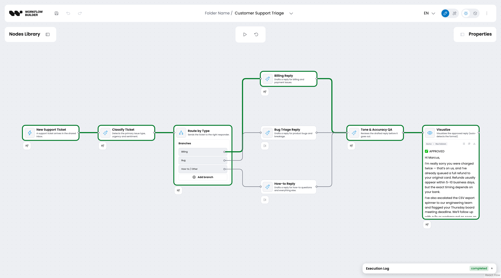
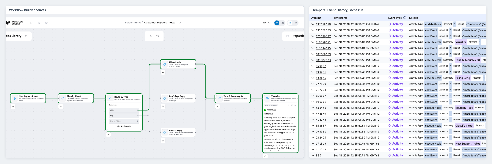
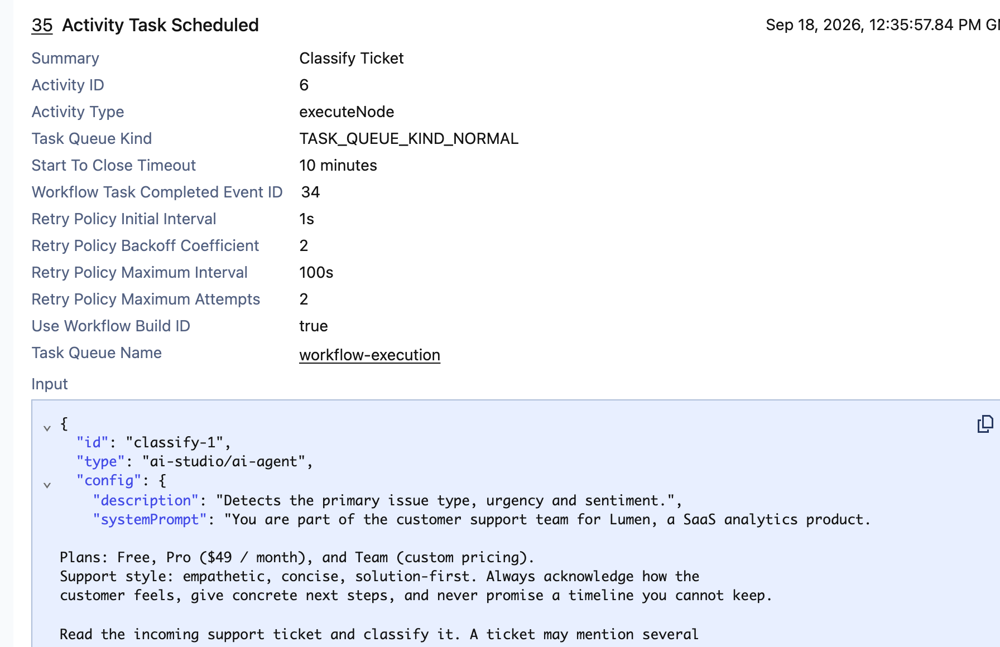

# Your users draw the workflow. Temporal runs it.

**Draft for Temporal co-marketing review.** Primary venue: workflowbuilder.io/blog and dev.to with a canonical link back.
**Author:** Dawid Aksamski, Senior Frontend Developer at Synergy Codes (Workflow Builder team).
**Status:** draft. Every screenshot comes from one real local run, documented in `temporal-co-marketing-shots.md`. Body is about 1,400 words.

---

Post intro, shown under the title:

> Temporal's UI was built for the engineers who wrote the workflow. The people who need to reroute a support-triage flow on a Tuesday afternoon are not those engineers. Here is how a diagram they draw becomes a Workflow Execution, and how the run comes back to their canvas.

## In short

Workflow Builder is a React SDK for embedding a visual workflow editor in your product. Its Temporal plugin, `@workflowbuilder/temporal`, interprets the diagram inside a Workflow: one node becomes one Activity, edges decide routing, and every event flows back so the canvas can show the run live. Your users change the flow. Your engineers never redeploy for it.

## Durable execution has no picture

Adopting Temporal solves the reliability half of running workflows. Retries, timeouts, long waits, and a complete Event History come with the engine. What does not come with it is anything a product user can look at or change.

That gap shows up fast. A product manager wants to add a branch to the support-triage flow. An operations lead wants to watch a run without learning what a Workflow Task is. A customer wants a flow of their own. Each of those requests lands on an engineer, who edits the Workflow code, ships a worker, and then answers "did it work?" by reading Event History aloud.

Teams that hit this build 3 things by hand: a canvas, a live status layer on it, and a sync between that layer and what Temporal actually did. The sync is what quietly consumes months.

## The workflow is data your users author

In Workflow Builder the diagram is data, not code. Users place nodes from a library, connect them with edges, and fill in each node's properties panel. In the support-triage flow below they wrote the prompt for "Classify Ticket", set the conditions on each branch of "Route by Type", and decided that a billing match goes to "Billing Reply" while everything else falls through to "How-to Reply".

Changing how the flow routes is a save, not a deploy. The graph travels to Temporal as the workflow input, so an edited diagram is simply the next run's input. Runs already in flight finish with the definition they started with, because Temporal recorded it in their history. No worker restart, no versioning patch, no engineer in the loop.

Engineers still own the vocabulary. Adding a new node type means writing an executor for it. Composing those types into a flow, and rerouting that flow next week, belongs to whoever owns the process.

## The Workflow is an interpreter

The plugin ships a graph runner that executes inside Temporal's Workflow sandbox. It reads the diagram from the workflow input, orders the nodes topologically along the edges, and executes them in waves.

For every node in a wave it schedules one `executeNode` Activity. When an executor returns a `nextPort`, the runner follows only the edges wired to that handle and prunes the rest, recording a `node_skipped` event for each node it will never reach. Each node's `errorPolicy` decides whether a failure fails the run, is absorbed, or is routed down an error edge. Every event carries a sequence number, so the order is the runner's, not the network's.

The plugin registers 3 Activities for that runner to call: `executeNode`, `emitEvent`, and `updateStatus`. It knows nothing about what a node means. The executor for each node type is yours, and so is the store the events land in.

```bash
npm install @workflowbuilder/temporal @temporalio/worker
```

A worker is the plugin, your executors, and your store:

```ts
import { NativeConnection, Worker } from '@temporalio/worker';
import { WorkflowBuilderPlugin } from '@workflowbuilder/temporal';
import { fileURLToPath } from 'node:url';

const plugin = new WorkflowBuilderPlugin({
  executors: {
    'ai-studio/trigger': executeTrigger,
    'ai-studio/decision': executeDecision,
    'ai-studio/ai-agent': executeAIAgent,
    'ai-studio/visualize': executeVisualize,
  },
  store: database,
});

const worker = await Worker.create({
  connection: await NativeConnection.connect({ address: process.env.TEMPORAL_ADDRESS }),
  taskQueue: plugin.taskQueue,
  workflowsPath: fileURLToPath(new URL('workflows.ts', import.meta.url)),
  plugins: [plugin],
});

await worker.run();
```

One more line is required, in your own workflows module:

```ts
export { runWorkflow } from '@workflowbuilder/temporal/workflow';
```

That re-export is not stylistic. The TypeScript SDK builds the workflow bundle from a single module, so a plugin cannot register a workflow on your behalf. Vercel's `AiSdkPlugin` documents the same constraint.

## The run comes back to the canvas

Every `node_started`, `node_completed`, `node_skipped`, and status change reaches your store through the `emitEvent` and `updateStatus` Activities, in order. What you do with them is yours. The reference stack writes them to Postgres and streams them to the browser over server-sent events, and the editor paints them onto the diagram.



The result is a live view of a Temporal run that a product user can read. The executed path is highlighted, the two branches the decision pruned stay grey, and "Visualize" shows the approved reply. The plugin draws none of this. It emits the facts, and the application decides how to show them.

## Two views, one truth

Product looks at the canvas. Operations looks at Event History. Until this year those two views did not agree, because every node ran through the same generic Activity and Event History showed a column of identical `executeNode` rows.

Temporal's `ActivityOptions` carries a `summary`, a single-line string the UI shows next to the event. The plugin fills it with the node's authored label, so the Compact view of Event History reads "New Support Ticket", "Classify Ticket", "Route by Type", "Billing Reply", "Tone & Accuracy QA", "Visualize". The same words the user typed.



One detail matters more than it looks. The label is clamped to 300 UTF-8 bytes, on code-point boundaries. The Summary is copied into every `ActivityTaskScheduled` event and lives as long as the run's history, so an unbounded label would grow every run that uses it. A node with no label gets no summary, and Temporal falls back to the activity type.

## Temporal still owns the hard parts

Retries, timeouts, and cancellation come from the Activity contract. The plugin does not reimplement them. It adds a sane default and a way to override it per node type.

Node activities default to 10 minutes and 2 attempts, because a node may call a model. The two database activities default to 30 seconds and 5 attempts, because they are fast idempotent writes. Both defaults are pinned by a test, so an upgrade cannot quietly change them.



An AI agent node in thinking mode needs more room than 10 minutes. Declare a profile for it:

```ts
export const runWorkflow = createRunWorkflow({
  nodeActivityProfiles: {
    'ai-studio/ai-agent': { startToCloseTimeout: '30m', retry: { maximumAttempts: 3 } },
  },
});
```

Entries are whole profiles, not partials. A partial could set a timeout and silently drop the retry cap, and Temporal's fallback there is unlimited retries with backoff. On a permanently failing model call, that is an unbounded bill.

The attempt count is an upper bound. An executor that throws `PermanentNodeExecutionError`, for a rejected API key, is not retried at all. `TransientNodeExecutionError` says another attempt is worth making, but the profile still caps it.

## What stays yours

Three things are deliberately yours.

- Connection, TLS, and credentials. The plugin never opens a connection
- Persistence. Events and status transitions arrive through a store port, so any database works
- The workflow bundle, for the reason above

Secrets deserve their own sentence. Temporal writes every argument you give it into Event History, and only event payloads are redacted. Keep model keys in the worker's environment, and read a per-tenant secret inside the executor, where Temporal records nothing.

Workflow Builder is a production-ready React SDK for embedding visual workflow editors into B2B SaaS products, built by Synergy Codes. It ships 3 composable blocks: the React editor layer, an Apache 2.0 reference backend, and swappable engine integrations, with Temporal as the reference adapter. The screenshots above come from that reference stack running the shipped Customer Support Triage template.

## Try it

[`@workflowbuilder/temporal`](https://www.npmjs.com/package/@workflowbuilder/temporal) is on npm, and the [reference stack](https://www.workflowbuilder.io/integrations/temporal) is the fastest way to watch a drawn diagram become a Workflow Execution. The [package README](https://github.com/synergycodes/workflowbuilder/tree/main/packages/temporal) covers the store port, the profile validation rules, and the payload size budget a long graph has to fit.

## FAQ

**Does Workflow Builder execute the workflow?**
No. Workflow Builder is engine-agnostic, and your engine executes. The plugin interprets the diagram inside a Temporal Workflow and schedules one Activity per node.

**Can users change routing without a deploy?**
Yes. Edges, decision branches, and their conditions are part of the diagram, and the diagram is the workflow input. Saving a change makes it the next run's definition. A new node type is still developer work, because it needs an executor.

**What happens to runs already in flight when the diagram changes?**
They finish with the definition they started with. Temporal recorded that definition as the workflow input, and replay reads it back from history.

**Can I set different timeouts per node type?**
Yes, through `createRunWorkflow({ nodeActivityProfiles })`. Declare the map once and hand the same constant to the plugin and to the workflow, or the two sides drift.

**Does the plugin work with Temporal Cloud?**
Yes. The plugin never opens the connection, so Cloud, a self-hosted cluster, and a local dev server are all the same to it.
