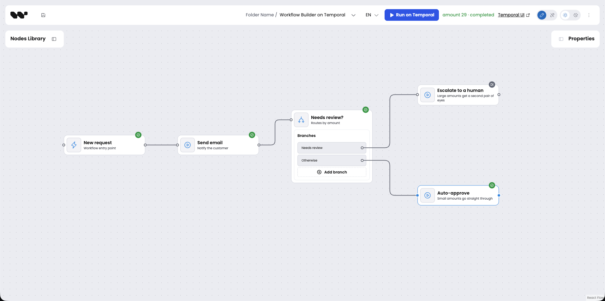
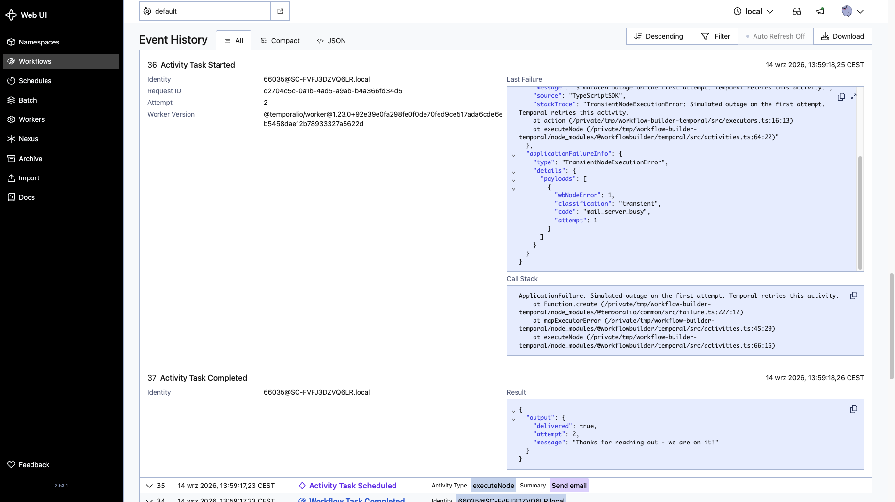

# Workflow Builder on Temporal

Run a workflow drawn in the Workflow Builder editor as a durable Temporal Workflow Execution: every node becomes an Activity, retries and history come from Temporal, and the canvas shows each node's status live.

This sample wires the [`@workflowbuilder/temporal`](https://www.npmjs.com/package/@workflowbuilder/temporal) plugin into a Temporal Worker and executes a five-node diagram authored in the [Workflow Builder](https://www.workflowbuilder.io) editor. One node fails on its first attempt on purpose, so the retry you see in Event History is a real one, and a decision node routes each run down one of two branches while the other is pruned. An optional editor lets you change the diagram and watch nodes light up while Temporal runs them.



## What runs where

```
editor (browser, optional)  --POST canvas snapshot-->  worker + bridge (npm start)  -->  Temporal (temporal server start-dev)
        ^                                                     |  executors: trigger, action, decision
        +----------- SSE: node events ------------------------+  store: prints events, streams them to the editor

npm run workflow  ---- reads shared/diagram.json, starts one run, waits for it ---->  Temporal
```

Three folders:

- `shared/` is what the two processes agree on: the diagram (`diagram.json`), the wire types (`protocol.ts`) and the coin flip (`amount.ts`).
- `worker/` is the Node side: the Temporal Worker with the plugin, the bridge the editor talks to, and the CLI client.
- `editor/` is the optional browser app.

The diagram:

```
New request (trigger)
  -->  Send email (action, simulates an outage on its first attempt)
  -->  Needs review? (decision)
         |-- "Needs review"  {{nodes.trigger-1.amount}} isGreaterThan 100 -->  Escalate to a human (action)
         '-- "Otherwise"     no conditions ---------------------------------->  Auto-approve (action)
```

## Prerequisites

- Node.js 22 (20 works).
- The Temporal CLI: install it from <https://docs.temporal.io/cli#install> (`brew install temporal` on macOS).
- Nothing else. No Docker, no database, no API keys.

`@workflowbuilder/temporal` is still in preview and not on npm, so `worker/` installs it from a
packed build committed under [`worker/vendor/`](worker/vendor/README.md). The steps below need
nothing extra; when the package ships, the dependency becomes an ordinary npm range.

## Run it

Fetch just this folder:

```bash
npx degit synergycodes/workflowbuilder/examples/workflow-builder-temporal workflow-builder-temporal
cd workflow-builder-temporal
```

Terminal 1, a local Temporal server:

```bash
temporal server start-dev
```

Terminal 2, the Worker:

```bash
cd worker
npm install
npm start
```

Expected, between Temporal's own startup lines:

```
worker polling task queue "workflow-execution" on 127.0.0.1:7233
bridge listening on http://127.0.0.1:3210
```

Terminal 3, one run of the diagram. Each run draws an amount between 1 and 200, and the decision node
routes on it, so about half the runs take each branch. Also from `worker/`:

```bash
npm run workflow
```

Expected in terminal 3:

```
amount 130
started execution-878ca8cc-44f8-44a9-a1a9-bb80faa12c76
watch it: http://localhost:8233/namespaces/default/workflows/execution-878ca8cc-44f8-44a9-a1a9-bb80faa12c76
run completed
```

Expected in terminal 2, the store printing what the workflow emitted. Temporal's own `Activity failed`
warning for the first attempt appears between lines 4 and 5, and the `decision-1` config line is long
because it carries the branches as authored:

```
[878ca8cc] # 1 execution_started {"workflowId":"workflow-builder-temporal-sample"}
[878ca8cc] # 2 node_started (trigger-1) {"config":{"description":"Workflow entry point","status":"active"},"visibleNodeIds":[]}
[878ca8cc] # 3 node_completed (trigger-1) {"output":{"amount":130,"customer":"Ada"}}
[878ca8cc] # 4 node_started (action-1) {"config":{"description":"Notify the customer","status":"active","message":"Thanks for reaching out - we are on it!","simulateOutage":true},"visibleNodeIds":["trigger-1"]}
[878ca8cc] # 5 node_completed (action-1) {"output":{"delivered":true,"attempt":2,"message":"Thanks for reaching out - we are on it!"}}
[878ca8cc] # 6 node_started (decision-1) {"config":{"description":"Routes by amount","status":"active","decisionBranches":[...]},"visibleNodeIds":["trigger-1","action-1"]}
[878ca8cc] # 7 node_completed (decision-1) {"output":{"branch":"Needs review","sourceHandle":"source:inner:review"}}
[878ca8cc] # 8 node_skipped (action-3) {"reason":"branch_not_taken"}
[878ca8cc] # 9 node_started (action-2) {"config":{"description":"Large amounts get a second pair of eyes","status":"active","message":"Flagged for manual review","simulateOutage":false},"visibleNodeIds":["trigger-1","action-1","decision-1"]}
[878ca8cc] #10 node_completed (action-2) {"output":{"delivered":true,"attempt":1,"message":"Flagged for manual review"}}
[878ca8cc] #11 execution_completed
[878ca8cc] status completed
```

Only `Send email` carries `"attempt":2`: it is the one node with the outage switch on. Run it again
until the amount comes out at 100 or below, and lines 7 to 10 take the other branch instead:

```
[734af0c9] # 7 node_completed (decision-1) {"output":{"branch":"Otherwise","sourceHandle":"source:inner:otherwise"}}
[734af0c9] # 8 node_skipped (action-2) {"reason":"branch_not_taken"}
[734af0c9] # 9 node_started (action-3) {"config":{"description":"Small amounts go straight through","status":"active","message":"Approved automatically","simulateOutage":false},"visibleNodeIds":["trigger-1","action-1","decision-1"]}
[734af0c9] #10 node_completed (action-3) {"output":{"delivered":true,"attempt":1,"message":"Approved automatically"}}
```

## What you will see in Temporal UI

Open the `watch it:` link. The run is one Workflow Execution. Each node is an Activity named after its label, because the plugin sets the node's label as the activity summary. Click `Send email`: attempt 1 failed with `mail_server_busy`, attempt 2 succeeded. The retry is Temporal's, governed by the plugin's default node profile (10 minutes, 2 attempts), not by anything in this sample. The Workflow input carries the amount the run was given.

The pruned branch leaves no trace here: there is an Activity for `Escalate to a human` and none at all for `Auto-approve`, because the workflow decided against that branch and never scheduled it.



## Optional: run it from the canvas

Keep terminals 1 and 2 running. The editor posts the canvas to the worker's bridge and reads events back from it. From the sample folder:

```bash
cd editor
npm install
npm run dev
```

Open the printed URL (Vite defaults to <http://localhost:5173>). The editor opens with the same diagram. Click **Run on Temporal**: the amount is drawn for that run and shown beside the button. Each node shows a spinner while its Activity runs, then a check; `Send email` spins through both attempts, and the branch that was not taken turns grey. Run it a few times and the grey node swaps sides. The **Temporal UI** link opens the run.

Then change things. Edit a message, turn the outage switch on for another action, select **Needs review?** and edit its branches in the properties panel, or add a node from the palette.

The editor keeps your canvas in the browser between visits. **Reset diagram** puts back the diagram in [`shared/diagram.json`](shared/diagram.json), which is also the one `npm run workflow` submits.

## How it works

Six places carry the whole integration. Each has a comment where the reason is not visible in the code.

1. [`worker/src/workflows.ts`](worker/src/workflows.ts) re-exports `runWorkflow`. Temporal bundles workflow code from one module, so a plugin cannot register its workflow for you; the re-export is how the bundle picks it up.
2. [`worker/src/worker.ts`](worker/src/worker.ts) creates `WorkflowBuilderPlugin({ executors, store })` and hands it to `Worker.create`. The plugin contributes the activities that execute a graph. Connection, task queue, and shutdown stay yours.
3. [`worker/src/executors.ts`](worker/src/executors.ts) is one function per node type. Executors run inside the plugin's `executeNode` Activity, which is why `action` can read Temporal's attempt number and why throwing `TransientNodeExecutionError` gets it retried while `PermanentNodeExecutionError` does not.
4. [`worker/src/evaluate-branches.ts`](worker/src/evaluate-branches.ts) picks a branch, and the decision executor returns its handle as `nextPort`. That is what makes the graph branch: the runner fires only the edge whose handle matches, marks the rest `node_skipped`, and if a named port has no edge at all the run ends `incomplete` rather than failing. The first branch whose conditions all hold wins, and a branch with no conditions always holds, so it belongs last. (The reference worker in the Workflow Builder repository never matches an empty branch; this sample prefers the rule you can read off the canvas.)
5. [`worker/src/store.ts`](worker/src/store.ts) implements the store port: where events and status changes land. Here they go to the terminal and to the editor's event stream. In your application they go to a database; the port is the same.
6. [`worker/src/to-definition.ts`](worker/src/to-definition.ts) turns the editor's snapshot into the plugin's `WorkflowDefinition`. The plugin knows nothing about React Flow; this file is the only glue.

[`worker/src/client.ts`](worker/src/client.ts) starts a run through `TemporalWorkflowEngine` from `@workflowbuilder/temporal/client` and then waits on an ordinary Temporal workflow handle. [`worker/src/bridge.ts`](worker/src/bridge.ts) does the same for the editor over HTTP and streams the store's events back as Server-Sent Events.

## Make it yours

- **Add a node type.** Add a palette item under `editor/src/nodes/` and register it in `editor/src/nodes/index.ts`; add a variant to `SampleNode` in `worker/src/nodes.ts` and an executor in `worker/src/executors.ts`. TypeScript refuses to compile until the executor exists.
- **Tune retries per node type.** Replace the re-export in `worker/src/workflows.ts` with `createRunWorkflow({ nodeActivityProfiles })` and pass the same map to the plugin. The plugin README explains why both sides need it.
- **Point at Temporal Cloud.** `TEMPORAL_ADDRESS`, `TEMPORAL_NAMESPACE`, and `TEMPORAL_UI_ORIGIN` are read in `worker/src/config.ts`. TLS and API keys go on the two connections in `worker/src/worker.ts` and `worker/src/client.ts`.
- **Toggle the outage.** Every Action has a _Simulate an outage on the first attempt_ switch. Turn it on for `Auto-approve` and that node retries too.
- **Add a branch.** Select **Needs review?**, add a branch on the node or in the properties panel, give it a title and conditions, then drag its new handle to a node. Keep the branch with no conditions last, or it swallows every run.
- **Persist events.** Replace `createRunStore()` with anything that implements `ExecutionStore`.

## Learn more

- [`@workflowbuilder/temporal` on npm](https://www.npmjs.com/package/@workflowbuilder/temporal): profiles, node labels in Event History, versioning and replay.
- [Workflow Builder documentation](https://www.workflowbuilder.io/docs/overview/)
- [Temporal TypeScript SDK](https://docs.temporal.io/develop/typescript)

## License

Apache-2.0. See [LICENSE](LICENSE).
